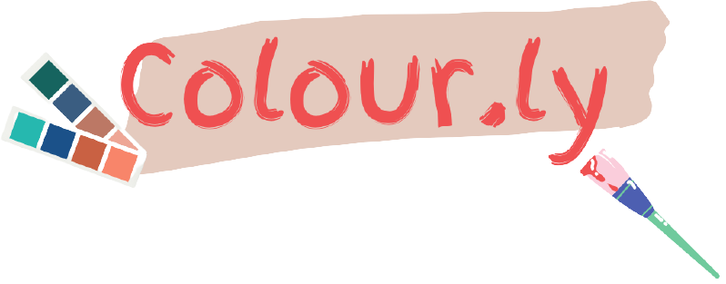
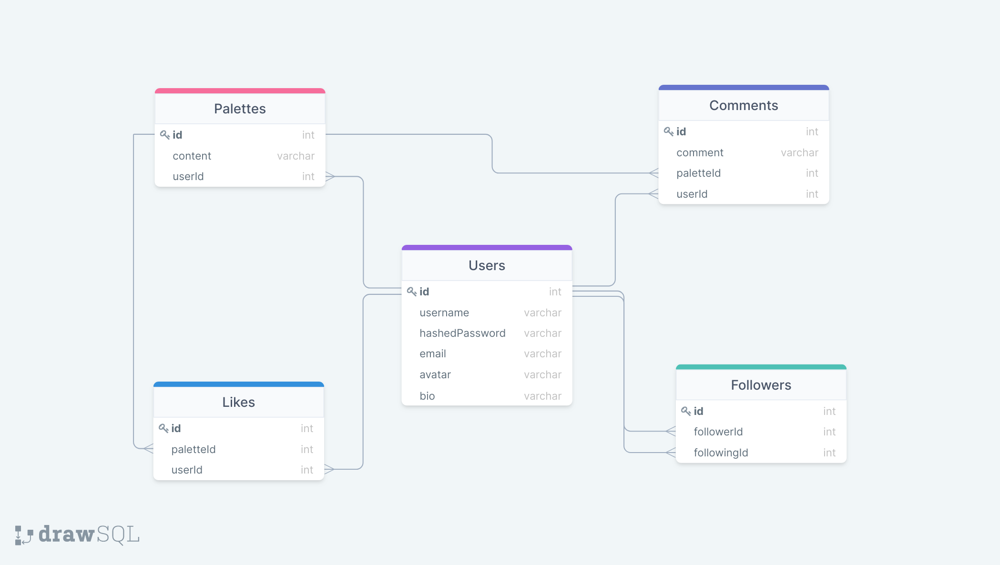

    

# Overview

**Colour.ly** is a colour palette application build for branding & marketing teams to create, share & store colour palettes for their projects.

Inspired by [Coolors](https://coolors.co/)

## Checkout the Live Site @ [colour-ly.herokuapp.com](https://colour-ly.herokuapp.com/)

# Sneak Peek 🙈

### Landing Page

[

## User Login and SignUp Pages

### Login Page

## Palette Pages

### Palette Home Page

### Palette Page

### Create Palette Page

## Profile Page

### User Profile

# Features

### User Authentication

-   Users can sign up, log in, and log out
-   Users can try out the app with a Demo User login
-   Most of the features will be unavailable to the guest user, such as creating colour palettes, commenting, or liking colour palettes.

### Colour Palette

-   Users can create a Colour Palette
-   Ability to adjust the colour intensity while creating the colour palette
-   Random colour generation capabilities while creating the colour palette
-   Users can delete their own colour palettes

### User Profile Page

-   Users can access their Colour Palettes
-   Users can delete their Colour Palette

### Share Colour Palette

-   User can share their Colour Palette

### User engagement

-   Follow and unfollow other users
-   User can like other user's Colour Palette
-   Liked user palettes will be added to User Favorite page
-   User can post comments on other user's Colour Palette
-   User can share other user's Colour Palette

#### Stretch Goals

-   Create a Team
-   Generate Colour Palette from an uploaded Image
-   Copy any colour to the clipboard in HEX, RGB, RGBA, HSLA format.

# Database Schema

# Backend Routes

## `auth`

-   `GET /api/auth` authenticates a user
-   `POST /api/auth/login` logs a user in
-   `GET /api/auth/logout` logs a user out
-   `POST /api/auth/signup` creates a new user and logs them in

## `users`

-   `GET /api/users/:id` gets user info with all color palettes created, total followers, following, etc.
-   `PUT /api/users/:id/about` to update the user biography
-   `GET /api/users/:id/favorites` gets all the palettes liked by user
-   `POST /api/users/:id/follow` to start following or unfollowing other users

## `palettes`

-   `GET /api/palettes` gets the 12 recently created palettes
-   `GET /api/palettes/popular` gets the 12 most popular palettes (popularity is based on palette with most likes)
-   `GET /api/palettes/:id` gets one single palette, its comments, likes and other info
-   `POST /api/palettes` creates a palette to be added to the site feed
-   `DELETE /api/palettes/:id` deletes a palette

## `likes`

-   `POST /api/palettes/:id/like` posts or removes a like on given colour palette

## `comments`

-   `POST /api/palettes/:id/comment` adds a comment to a palette

## `search`

-   `POST api/palettes/search` to search Users or Palettes

# Frontend Routes

-   `/` Home page featuring randomly generated Colours (New Colours will be generated with every page refresh)
-   `/palettes` Home page featuring recent and most popular colour palettes
-   `/login` User login
-   `/signup` User signup
-   `/users/:id` User Profile
-   `/users/:id/favorites` User's favorite palettes
-   `/palettes/:id` Single Palette View
-   `/palettes/create` Create a new palette
